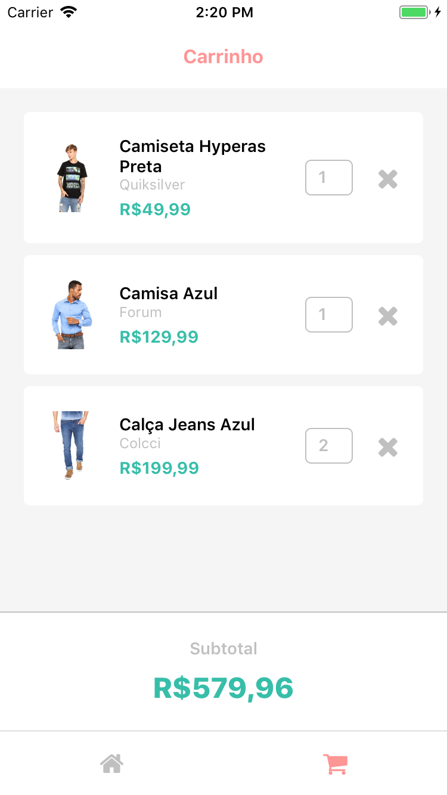

# Ecommerce App

Learning [React Native](https://facebook.github.io/react-native/) with an example of ecommerce project




## Prerequisites

- [NodeJs](https://nodejs.org/en/)
- [React Native](https://facebook.github.io/react-native/docs/getting-started.html)
- [JSON Server](https://github.com/typicode/json-server)

## Install

1. Open Terminal
2. Clone this repository
3. Go to the project folder
4. Install dependencies
```
git clone https://github.com/drimarques/ecommerce.git
cd ecommerce
npm install
```

## Usage

Run server
```
json-server server.json
```

Run app
```
react-native start
react-native run-ios or react-native run-android
```